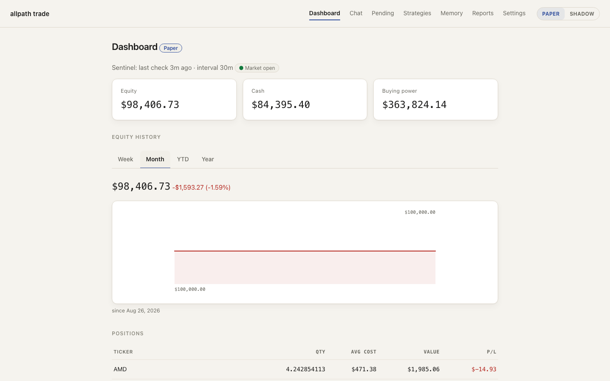
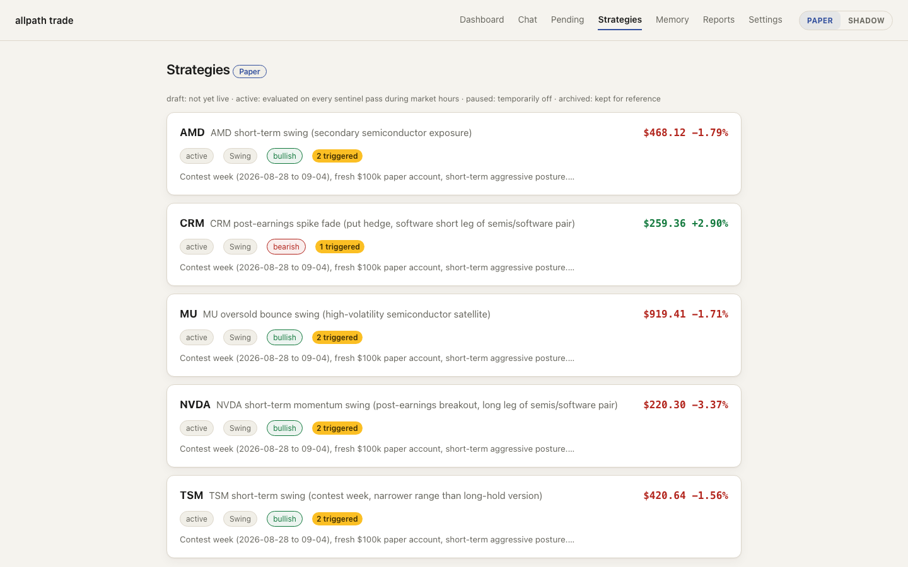
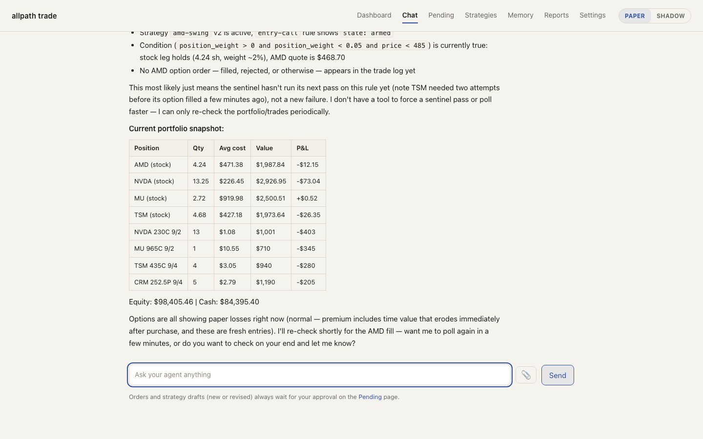
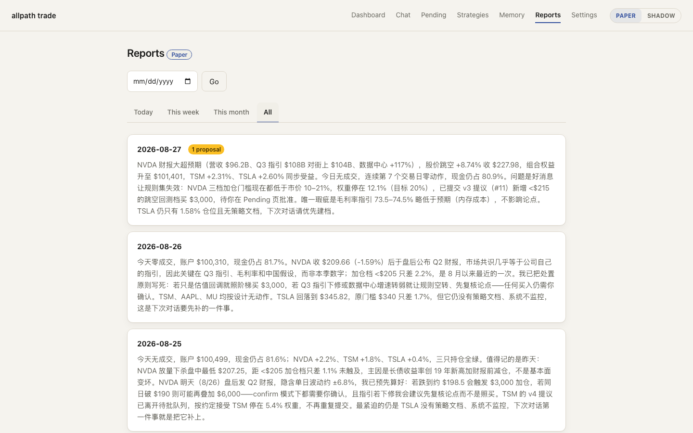
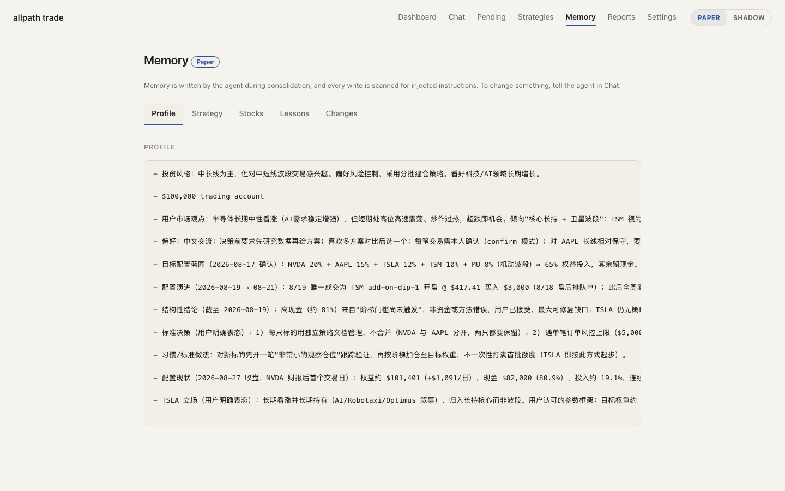
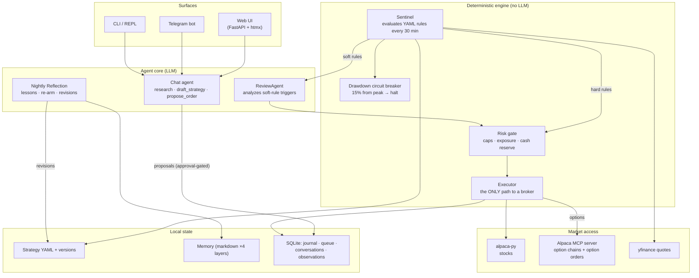
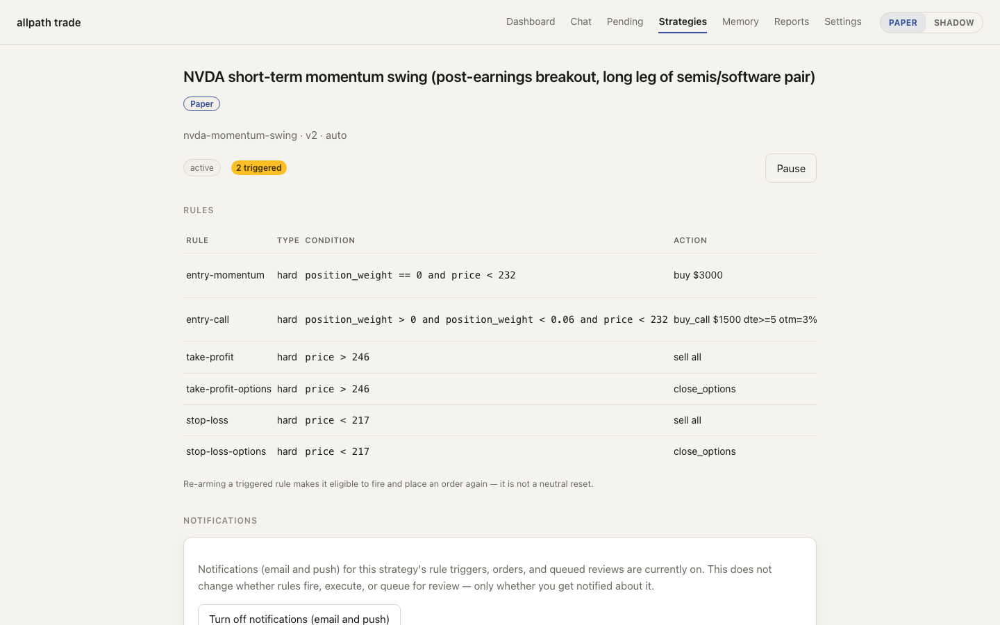
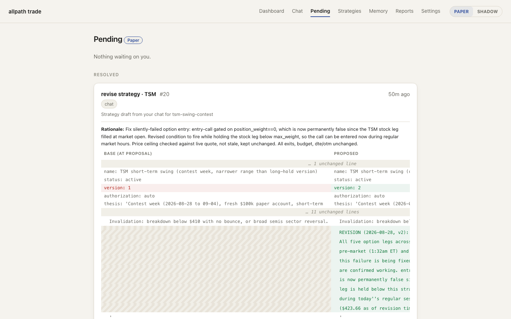

<div align="center">

# All Path Trading Agent

**A self-hosted, LLM-powered autonomous trading agent framework**

*It learns your goals, co-creates strategies with you, monitors the market, trades stocks and options through your own brokerage account — and grows alongside you.*

[](LICENSE)
[](https://www.python.org/downloads/)
[](https://github.com/astral-sh/ruff)
[](#development)
[](#contributing)

[Getting Started](#getting-started) ·
[Architecture](#architecture) ·
[Options via MCP](#options-trading-via-alpacas-mcp-server) ·
[Autonomy](#the-autonomy-ladder) ·
[Memory](#the-memory-system) ·
[Safety](#safety-model) ·
[中文文档](README.zh-CN.md) ·
[**Website →**](https://trading.all-path.com)

</div>

---

<p align="center">
  
</p>

<p align="center"><b>An agent that reasons like an analyst and executes like a machine.</b><br>
Strategies are human-readable YAML documents — a prose thesis plus deterministic rules. A sentinel evaluates them on a schedule at zero LLM cost; an agent researches, drafts, reflects nightly, and revises its own strategies; a deterministic risk gate that no model can bypass sits in front of every order. You choose the autonomy level per strategy: notify-only, confirm-first, or fully autonomous.</p>

<p align="center">
  <code>rule fires → contract selected via Alpaca MCP → risk gate → order → journal → notification → nightly reflection</code>
</p>

> **🏆 Currently competing in the [Alpaca AI Trading Agents Hackathon](https://lablab.ai/ai-hackathons/alpaca-ai-trading-agents-hackathon) (Aug 28 – Sep 4, 2026).** The screenshots in this README are the *live competition account*: a fresh $100k paper account run with **zero human intervention** — the agent picked the tickers, drafted the strategies (stock + options legs with paired exits), executes autonomously, and revises itself every night. Options data and order routing go through **Alpaca's official MCP server**. See [The Live Autonomous Run](#the-live-autonomous-run).

## Table of Contents

- [Why AllPath](#why-allpath)
- [System at a Glance](#system-at-a-glance)
- [Architecture](#architecture)
- [The Strategy System](#the-strategy-system)
- [The Trading Loop](#the-trading-loop)
- [Options Trading via Alpaca's MCP Server](#options-trading-via-alpacas-mcp-server)
- [The Autonomy Ladder](#the-autonomy-ladder)
- [Nightly Reflection & Self-Revision](#nightly-reflection--self-revision)
- [The Memory System](#the-memory-system)
- [Safety Model](#safety-model)
- [Notifications](#notifications)
- [Surfaces: Web, Telegram, CLI](#surfaces-web-telegram-cli)
- [Two Accounts: Paper & Shadow](#two-accounts-paper--shadow)
- [The Live Autonomous Run](#the-live-autonomous-run)
- [Getting Started](#getting-started)
- [Project Structure](#project-structure)
- [Roadmap](#roadmap)
- [Development](#development)
- [Contributing](#contributing)
- [Security](#security)
- [Disclaimer](#disclaimer)
- [License](#license)

## Why AllPath

Most LLM trading projects stop at *"here's my analysis."* Most algorithmic frameworks execute code but cannot reason, remember, or explain themselves. **AllPath** closes the loop:

| Capability | Description |
|---|---|
| **Conversational strategy co-creation** | The agent interviews you, researches live prices and news, and drafts strategies as readable YAML — thesis in prose, entry/exit rules as deterministic expressions |
| **Autonomous monitoring & execution** | A scheduled sentinel evaluates every rule with plain code (no LLM cost); triggers execute through a risk gate, queue for approval, or just notify — per-strategy, your choice |
| **Options, natively** | Strategies can buy calls/puts and close option positions; contract selection and order routing go through Alpaca's official MCP server |
| **Self-evolution** | A nightly reflection session reviews the day against every thesis, writes lessons to memory, re-arms spent triggers, and proposes (or, in experiment mode, applies) strategy revisions |
| **Layered memory** | User profile, strategy history, per-stock dossiers, distilled lessons — curated markdown a human can read and audit, consolidated nightly |
| **Defense in depth** | Deterministic risk gate, account-level drawdown circuit breaker, option expiry sweep, market-hours guards, byte-exact revision staleness checks — none of it bypassable by the model |
| **Fully self-hosted** | Your keys, your data, your machine. SQLite + markdown on disk; no external services beyond your LLM provider and your brokerage |

It runs as the Python package **`allpath-trade`**: one process hosts the web UI, the scheduler, the Telegram bridge, and the agent.

## System at a Glance

<table>
<tr>
<td width="50%"></td>
<td width="50%"></td>
</tr>
<tr>
<td align="center"><sub><b>Strategies</b> — YAML documents with lifecycle badges, authorization tiers, armed/triggered rule states, and full version history</sub></td>
<td align="center"><sub><b>Chat</b> — the same agent on web and Telegram; drafts and orders become approval cards, never direct writes</sub></td>
</tr>
<tr>
<td width="50%"></td>
<td width="50%"></td>
</tr>
<tr>
<td align="center"><sub><b>Reports</b> — every nightly reflection: day summary, per-strategy check, lessons, revision proposals, and a replay of every tool call</sub></td>
<td align="center"><sub><b>Memory</b> — profile / strategies / stock dossiers / lessons, tabbed, with an audited change log</sub></td>
</tr>
</table>

## Architecture



Three loops share one process:

1. **Conversation loop** (on demand) — you talk; the agent researches with live tools; anything touching money or strategy files becomes an approval-queue proposal.
2. **Sentinel loop** (every 30 minutes during market hours, configurable) — deterministic rule evaluation at zero LLM cost. Hard rules execute with no model in the path; soft rules wake a cheap ReviewAgent to research before deciding.
3. **Reflection loop** (nightly, after close) — a bounded agent session reviews the day, updates memory, re-arms burned triggers, and proposes strategy revisions.

Design documents live in [`docs/superpowers/specs/`](docs/superpowers/specs/), implementation plans in [`docs/superpowers/plans/`](docs/superpowers/plans/) — the project is built spec-first and the whole paper trail is in the repo.

## The Strategy System

A strategy is one YAML file: a **thesis** (prose — why this position exists) plus **rules** (machine-checkable expressions). This is the live NVDA strategy from the competition account, drafted entirely by the agent:

```yaml
name: NVDA short-term momentum swing (post-earnings breakout)
status: active
authorization: auto          # notify | confirm | auto
thesis: >
  Post-earnings momentum: Q2 EPS $2.22 beat, data-center +117% YoY,
  guidance above street. Long leg of a semis-vs-software pair against
  a CRM put hedge. Holding period 1-5 days.
position: {ticker: NVDA, target_weight: 6%}
rules:
  - {id: entry-momentum, type: hard,
     condition: "position_weight == 0 and price < 232",
     action: "buy $3000"}
  - {id: entry-call, type: hard,
     condition: "position_weight > 0 and position_weight < 0.06 and price < 232",
     action: "buy_call $1500 dte>=5 otm=3%"}
  - {id: take-profit, type: hard, condition: "price > 246", action: "sell all"}
  - {id: take-profit-options, type: hard, condition: "price > 246", action: "close_options"}
  - {id: stop-loss, type: hard, condition: "price < 217", action: "sell all"}
  - {id: stop-loss-options, type: hard, condition: "price < 217", action: "close_options"}
```

**Rule conditions** are evaluated by a whitelist-AST expression evaluator (no `eval`) over a small context: `price`, `position_qty`, `position_weight`, `avg_entry_price`, `pnl_pct`, `target_weight`.

**Actions** are a closed grammar:

| Action | Meaning |
|---|---|
| `buy $3000` / `buy to target_weight` | Notional stock buy |
| `sell all` / `sell 50%` / `sell $2000` | Stock exit |
| `buy_call $1500 dte>=10 otm=3%` | Buy call options: budget, min days-to-expiry, percent out-of-the-money (defaults `dte>=7`, `otm=2%`) |
| `buy_put $1500 dte>=5 otm=3%` | Buy puts — directional or as a hedge leg |
| `close_options` | Sell-to-close every option position on this underlying |

**Rule types**: `hard` rules execute deterministically (stop-losses cannot fail because a model or API is down); `soft` rules wake the ReviewAgent to research current conditions first. **One-shot semantics**: a fired rule burns to `triggered` and never silently re-arms — re-arming is an explicit act (yours, or the nightly reflection's).

Every change to a strategy file is versioned with its rationale. Strategy-parse validation enforces safety invariants at authoring time — e.g. option actions require `authorization: auto` + hard rules, and any strategy with option entries must carry `close_options` exit rules.

<p align="center">
  
</p>

## The Trading Loop

What happens when a rule fires, end to end:

1. **Sentinel** (deterministic, scheduled) fetches quotes for each active strategy's underlying, builds the evaluation context, and checks every armed rule. Option rules are skipped—left armed—outside US market hours, so a trigger can never burn into a venue rejection overnight.
2. **Dispatch by (rule type × authorization)**:
   - `auto` + hard → execute now.
   - `auto` + soft → the **ReviewAgent** (a cheap model with read-only research tools) analyzes the trigger and approves or skips it, with its reasoning attached.
   - `confirm` → queued to **Pending** with the ReviewAgent's analysis attached; you approve on web/Telegram (inline buttons) or via a tokenized approve-by-link from the push notification.
   - `notify` → you get a notification; nothing else happens.
3. **Option actions** resolve a concrete contract at trigger time through the MCP server (see below); stock actions become notional orders.
4. **Risk gate** — deterministic checks no model can bypass: per-order value cap, resulting position weight cap, total options exposure cap, cash reserve, daily trade cap. Sells and closes are never blocked by value caps — reducing risk is always allowed.
5. **Executor** submits through the broker layer, polls the fill, and journals everything — order, decision, reasons, fill price, timestamps — into SQLite.
6. **Notification receipt** goes to every configured channel, including for autonomous executions ("it traded without me" is exactly when you want to hear about it).

<p align="center">
  
</p>

## Options Trading via Alpaca's MCP Server

Options support is built on **[Alpaca's official MCP server](https://github.com/alpacahq/alpaca-mcp-server)** — the agent's option-chain queries and option orders speak MCP, while stock routing stays on `alpaca-py`:

```
sentinel rule "buy_call $1500 dte>=10 otm=3%" fires
   │
   ├─ McpOptionsBackend (persistent `uvx alpaca-mcp-server` subprocess, stdio)
   │     get_option_contracts  → expirations ≥ today+dte, calls only
   │     nearest expiry, strike closest to spot × 1.03
   │     get_option_latest_quote → ask price
   │     qty = floor($1500 / (ask × 100))
   │
   ├─ RiskGate.check_option    → premium ≤ per-order cap,
   │                             total option exposure ≤ 10% of equity,
   │                             cash reserve, shared daily trade cap
   │
   └─ place_option_order (MCP) → buy_to_open, market, day
         → journal, fill poll, notification receipt
```

Engineering details that matter for reliability:

- The MCP server runs as a **managed subprocess** — lazily spawned, watchdogged with a per-spawn ownership handle, one automatic respawn on transport failure, 30-second call timeouts, and clean teardown on exit and on settings-driven rebuilds. A hung MCP call cannot wedge the sentinel.
- **Deterministic contract selection** — the LLM never picks strikes freehand; it writes intent parameters (budget, DTE floor, OTM percent) and plain code resolves the contract.
- **Expiry safety sweep** — any held option with ≤ 1 day to expiry is closed automatically during market hours; positions never ride into exercise/assignment.
- **Honest failure** — a broker response that carries no order id is journaled as an *error* and notified, never mistaken for a fill. (This guard exists because we hit exactly that failure live — a pre-market submission — on competition day one, and the system now refuses to be silently wrong.)
- Scope is deliberately conservative in v1: **single-leg long options only** (buy calls/puts, sell-to-close). No naked writing, no multi-leg spreads. Hedging is expressed as buying puts on the opposite leg.

## The Autonomy Ladder

Autonomy in AllPath is **per-strategy, explicit, and graduated** — not a global switch:

| Tier | Trigger behavior | Who decides |
|---|---|---|
| `notify` | You get a push; nothing executes | You, out of band |
| `confirm` *(default)* | Queued to Pending with agent analysis attached | You, one tap |
| `auto` + soft rule | ReviewAgent researches, then approves or skips | A cheap LLM, journaled |
| `auto` + hard rule | Executes immediately through the risk gate | Plain code |

Promoting a strategy to `auto` is guarded everywhere: proposal cards warn loudly, the nightly reflection is *frozen out* of changing authorization at all, and the UI confirms before activating. For fully unattended operation, two more layers back it up:

- **Drawdown circuit breaker** — account equity is peak-tracked every sentinel pass; a configurable drawdown from peak (default **15%**) trips once: every `auto` strategy is demoted to `confirm`, a high-priority alert goes to every channel, and a dashboard banner stays up until you review and run `allpath-trade breaker reset`. Demotion is asymmetric by design: **option exits still execute** after a trip — the breaker stops new risk, never risk reduction.
- **Experiment flag for self-revision** (`EXPERIMENT_AUTO_APPLY_REVISIONS`, default off) — lets the nightly reflection's own strategy revisions apply without human approval, turning the system into a genuinely self-evolving agent for bounded validation runs like the current competition week. Every safety check still applies (see [Safety Model](#safety-model)).

## Nightly Reflection & Self-Revision

After each trading day closes, a bounded agent session (12 tool calls, wall-clock deadline) receives a fenced briefing — the day's trades with fills, observations, current positions with price changes, every active strategy's thesis and rule states — and produces:

- **A written report** with a push-sized summary — one row per day on the Reports page, with a full transcript replay of every tool call the session made.
- **Durable memory updates** — confirmed patterns and broken assumptions written to the same curated memory every other loop reads.
- **Trigger re-arms and strategy revisions** — when a one-shot rule burned that day, reflection decides whether to re-arm it at a re-justified level or rewrite it; when reality diverges from a thesis, it proposes a revision as a full diff with rationale.

Revisions flow through a single hardened applier — the only code path that writes a strategy file:

- **Byte-exact staleness check**: the file's current content must match what the proposal was diffed against, or approval is refused.
- **Version monotonicity** and id immutability.
- **The reflection freeze**: reflection revisions may touch thesis and rules only — never `authorization` (no self-promotion to `auto`), never `status`.
- In experiment mode the same checks run — auto-apply is auto-*approval*, not a bypass. A failed check leaves the proposal pending for human eyes.

## The Memory System

Memory is **curated markdown, not embeddings** — small enough to read, audited on every write:

| Layer | Contents | Cadence |
|---|---|---|
| `user_profile.md` | Risk tolerance, goals, decision habits | Slowly evolving; shared across accounts |
| `strategies/` | Per-strategy working notes and revision rationale | Per revision |
| `stocks/` | Per-ticker dossiers: behavior patterns, trade history, ticker-specific lessons | Compounds over time |
| `lessons.md` | Distilled cross-cutting insights from retrospectives | Nightly |

Around the layers:

- **Observations journal** — every sentinel trigger, execution, skip, breaker event, and reflection outcome is an append-only observation row; it's the raw feed reflection and consolidation read.
- **Nightly consolidation** — a dedicated pass (run on the strongest model tier, because a bad call here pollutes every later conversation) reads the day's conversations across web, Telegram, and terminal plus the observations journal, and decides what deserves to enter long-term memory. Per-layer size budgets force prioritization; every change lands in an audited `memory_log` diff.
- **Injection defense** — external content (search results, fetched pages) is fenced before it reaches memory-writing paths, and `MemoryStore.apply` guards against instruction smuggling inside memory updates.
- **Full-text session search** (SQLite FTS5) — the agent can search every past conversation and observation, per account.
- **Three model tiers** — `CHAT_MODEL` for conversation and drafting, `REVIEW_MODEL` (cheap) for the hourly sentinel analysis, `MEMORY_MODEL` (strong) for consolidation and reflection. Bring your own provider: Anthropic, OpenAI, or OpenRouter.

## Safety Model

One invariant everything else hangs off: **the LLM can never bypass your limits.**

```
LLM / YAML rules → OrderIntent / OptionIntent → RiskGate (plain code) → Broker SDK / MCP
                                                     │
                                               SQLite journal (full audit trail)
```

| Guarantee | Mechanism |
|---|---|
| Single path to any broker | `Executor.execute()` / `execute_option()` are the only submitting code paths; the LLM can only produce intents |
| Deterministic pre-trade checks | Order value cap, position weight cap, options exposure cap (10% of equity), cash reserve, daily trade cap — plain code, no model in the loop |
| Account-level kill switch | Drawdown circuit breaker: 15% from peak → all `auto` strategies demoted, alert on every channel, manual reset required |
| Risk reduction always allowed | Sells and option closes are exempt from value caps and (for closes) the daily cap — a stop-loss or safety sweep can never be blocked by a limit |
| Options never ride to expiry | DTE ≤ 1 sweep closes remaining option positions during market hours |
| Market-hours discipline | Option rules are skipped (left armed) while the venue is closed; a closed-market submission can't silently burn a one-shot trigger |
| Honest failure | A broker response without an order id journals an **error** and notifies — never a phantom "submitted" |
| No self-promotion | Reflection revisions are frozen out of `authorization`/`status`; only a human promotes a strategy to `auto` |
| Stale writes refused | Byte-exact base check on every revision approval; version numbers strictly increase |
| Fail-safe stop-losses | Hard rules execute without the LLM — immune to model/API outages |
| Paper-first | Live trading requires an explicit `allow_live` opt-in and still passes the same gate |
| Local credentials | All keys live in a local gitignored `.env`; the web session cookie is `HttpOnly`/`SameSite=Strict`; state-changing routes are same-origin checked |

## Notifications

Every event reaches you on the channels you configure — with per-channel save-and-test so "configured" means *verified*:

| Channel | What it carries |
|---|---|
| **Email (SMTP)** | Full-body notifications: rule triggers, order receipts with fills, daily digest, complete nightly reflection report |
| **ntfy push** | Phone-banner-sized summaries of the same events — including a tokenized **approve-by-link** for pending confirmations |
| **Telegram** | Everything mirrored into your paired chat, with **inline Approve/Reject buttons** (row-bound, single-use nonce) on pending items and receipts for every execution |

Notification honesty is a design rule: autonomous executions send receipts too; shadow-account messages say "recorded — place it yourself" rather than pretending an order exists; every subject is prefixed `[Paper]` / `[Shadow]`; and a strategy-level `notify_email` toggle quiets a noisy strategy without ever silently changing what executes.

## Surfaces: Web, Telegram, CLI

**Web UI** (`allpath-trade serve`, FastAPI + htmx, no npm) — seven token-gated pages: Dashboard (equity curve, positions, strategy cards, sentinel heartbeat, breaker banner), Chat (with image attachments — paste a brokerage screenshot and the agent reads the table back), Pending, Strategies (+ per-strategy detail with version history), Memory, Reports (with transcript replay), Settings (keys write-only, model dropdowns from a cached OpenRouter catalog, notification save-and-test, Usage panel with real token costs). A first-run setup wizard collects keys so you never hand-edit `.env`.

**Telegram** — the same agent, same conversation, same memory as web chat, mirrored both ways; `/account` switches Paper/Shadow; approvals are inline buttons. Pair once with `/start <web token>` in a private chat.

**CLI** — `status`, `chat` (full REPL), `strategies`, `rearm`, `reviews list/approve/reject`, `breaker status/reset`, `memory show`, `check` (one sentinel pass), `serve`.

## Two Accounts: Paper & Shadow

Two always-on accounts run in parallel — separate strategies, memory, queues, reflection, and equity curves, one shared user profile:

| Account | What it is |
|---|---|
| **Paper** | An Alpaca paper account — orders actually route to Alpaca's simulated execution. This is the competition account. |
| **Shadow** | A local ledger that mirrors your **real** brokerage. It holds no real credentials and never routes an order — decisions are *recorded*, and the notification tells you to place the trade yourself if you agree. Import positions by chat, screenshot, or CSV. |

The point is comparison: same market, same agent, two postures — the sandbox where failure is free versus the ledger that shadows what you actually hold. Every page and notification is unambiguous about which account you're looking at.

## The Live Autonomous Run

For the hackathon, the system runs a documented, reproducible experiment ([runbook](docs/experiment-autonomous-run.md)):

- **Fresh $100k paper account**, zero human intervention after a single kickoff conversation.
- The agent **validated the operator's market theses against live data** — accepted one (semis/software rotation, redesigned as long-NVDA + CRM-put after finding the two were co-moving), *rejected* another with evidence (no META catalyst in the window + pending litigation) — then drafted a five-strategy portfolio: every strategy `auto`, every strategy carrying a stock and/or option leg with paired profit/stop exits.
- **Sentinel every 30 minutes; reflection every night** with revision auto-apply on — the agent re-arms its own spent triggers and amends its own strategies, inside the freeze and staleness guards.
- Safety rails live: risk gate on every order, 15% drawdown breaker armed, expiry sweep on, market-hours discipline enforced.
- Everything is journaled: every trade, every skip, every LLM decision, every nightly report with its full tool-call transcript — the audit trail *is* the demo.

Judging criteria mapping — P&L (live equity curve on the dashboard), technology (this document), creativity (a self-revising memory-bearing agent, not a signal bot), execution (the paper trail above).

## Getting Started

The fastest path: install, run `serve`, open the URL — a first-run setup wizard walks you through an LLM key, Alpaca paper keys, and optional Shadow import, so you never hand-edit `.env`.

### Prerequisites

- Python ≥ 3.11 and [uv](https://docs.astral.sh/uv/)
- A free [Alpaca paper trading account](https://app.alpaca.markets/paper/dashboard/overview) (enable options level ≥ 2 for options strategies)
- SQLite built with FTS5 (standard in official Python ≥ 3.11 builds)

### Installation

```bash
git clone https://github.com/dukesky/allpath-trading-agent.git
cd allpath-trading-agent
uv sync
```

### Run

```bash
uv run allpath-trade serve
```

Open `http://localhost:8791` and follow the setup wizard. The access token is printed on startup and stored as `WEB_TOKEN` in `.env`. To reach it from your phone on the same network: `uv run allpath-trade serve --host 0.0.0.0` (only on a network you trust — there is no built-in HTTPS).

The sentinel, nightly reflection, memory consolidation, and Telegram bridge all run inside this one process.

### Verify from the terminal

```bash
uv run allpath-trade status    # account, positions, recent journal
uv run allpath-trade chat      # talk to the agent in a REPL
```

### Key configuration (`.env`)

| Variable | Default | Purpose |
|---|---|---|
| `SENTINEL_INTERVAL_MINUTES` | 60 | Sentinel cadence during market hours |
| `OPTIONS_TRADING` | false | Enable the options backend (spawns the Alpaca MCP server) |
| `DRAWDOWN_HALT_PCT` | 0.15 | Circuit-breaker threshold; 0 disables |
| `EXPERIMENT_AUTO_APPLY_REVISIONS` | false | Reflection's own revisions auto-apply (bounded-experiment use) |
| `DAILY_REFLECTION` | true | Nightly reflection pass |
| `CHAT_MODEL` / `REVIEW_MODEL` / `MEMORY_MODEL` | — | Per-tier model choice, any OpenAI-compatible or Anthropic provider |

## Project Structure

```
allpath_trade/
├── agent/          # LLM tool loop, chat/review/reflection tools, context assembly
├── broker/         # Broker abstraction, Alpaca adapter, MCP options backend, shadow ledger
├── data/           # Market data (yfinance, cached)
├── risk/           # Risk gate + drawdown circuit breaker
├── store/          # SQLite: journal, review queue, conversations, observations, app state
├── strategy/       # YAML model, action grammar, whitelist-AST evaluator, versioned store
├── web/            # FastAPI app: 7 pages, auth, account switcher, setup wizard
├── notify/         # Email, ntfy, Telegram dispatch + event builders
├── sentinel.py     # The monitoring pass: rules → dispatch → execute/queue/notify
├── reflect.py      # Nightly reflection session
├── execution.py    # Executor — the single trading entry point (stocks + options)
├── scheduler.py    # APScheduler wiring: sentinel ticks + after-close chain
└── cli.py          # CLI: status, chat, serve, breaker, reviews, rearm, ...
```

## Roadmap

| Phase | Scope | Status |
|:---:|---|:---:|
| 1–4 | Execution foundation → strategy engine + sentinel → agent core → memory system | ✅ |
| 5–5.5 | Web UI, notifications (email/ntfy), setup wizard, UI polish | ✅ |
| 6–6.6 | Nightly reflection, Telegram channel, chat strategy proposals | ✅ |
| 7 | Shadow dual-active accounts | ✅ |
| 8 | **Autonomous operation** — auto tier hardening, drawdown circuit breaker, reflection revision auto-apply (experiment flag), broker socket timeouts | ✅ |
| 9 | **Options via Alpaca MCP server** — single-leg calls/puts, deterministic contract selection, option risk checks, expiry sweep, market-hours discipline | ✅ |
| Next | Multi-leg spreads, Greeks-aware selection, weekly/monthly report aggregation, holiday calendar, more brokers (IBKR via `ib_async`) | 🔜 |

## Development

```bash
uv run pytest                  # 2368 tests, network-free
uv run pytest -m integration   # live integration tests (Alpaca paper keys required)
uv run ruff check .            # lint
```

**Engineering conventions** — Python ≥ 3.11, synchronous core; monetary values are `Decimal`, never `float`; money-path modules ship with exhaustive unit tests; unit tests never touch the network (broker/data/MCP clients are injectable fakes); every feature is built spec-first with the design docs committed alongside the code.

## Contributing

Contributions are welcome. High-impact areas:

- **Broker adapters** — Interactive Brokers (via `ib_async`), Tradier, Charles Schwab
- **Options depth** — multi-leg orders, Greeks-aware contract selection
- **Data sources** — Tiingo (EOD), Finnhub (news / sentiment)
- **Hardening** — edge cases and test coverage on the money path

Please open an issue to discuss substantial changes before submitting a pull request.

## Security

- Never commit `.env` or any credentials; the repository's `.gitignore` excludes them by default.
- The adapter layer delegates all authentication and transport to official broker SDKs and Alpaca's official MCP server.
- To report a vulnerability, please open a GitHub issue with minimal details and a contact method, and we will follow up privately.

## Disclaimer

This is self-hosted software provided under the MIT license, **not investment advice**. Trading — especially options trading — involves substantial risk of loss. You are solely responsible for your trading decisions, your credentials, and compliance with your broker's terms of service. Start with paper trading; enable live trading only after you fully understand and accept the risks.

## License

This project is licensed under the [MIT License](LICENSE).
