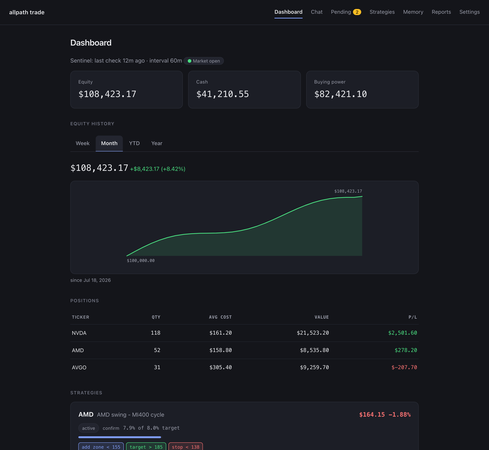

<div align="center">

# All Path Trading Agent

**自部署、基于 LLM 的中长线交易 agent 框架**

*它了解你的目标，与你共创策略，监控市场，通过你自己的券商账户执行交易——并与你共同成长。*

[](LICENSE)
[](https://www.python.org/downloads/)
[](https://github.com/astral-sh/ruff)
[](#路线图)
[](#参与贡献)

[快速上手](#快速上手) ·
[架构](#架构) ·
[安全模型](#安全模型) ·
[路线图](#路线图) ·
[参与贡献](#参与贡献) ·
[English](README.md) ·
[**官网 →**](https://trading.all-path.com)

</div>

---

<p align="center">
  
</p>

<p align="center"><b>一个只提案、不擅自行动的交易 agent。你来批准。</b><br>
用 YAML 写策略，哨兵每小时巡检；和一个记得你思路的 agent 聊天（网页或 Telegram）；每一笔订单前面都有一道人工审批门。默认模拟盘；agent 没有任何直接下单或写策略文件的工具。</p>

<p align="center"><sub>截图均为虚构演示数据，非真实账户。</sub></p>

---

> **项目状态：** Phase 1-6 已完成——券商连接、行情数据、风控和交易日志已可对接 Alpaca 模拟盘账户；策略引擎 + 哨兵循环（YAML 策略、规则求值、版本管理、定时监控、硬规则自动执行）现已运行；LLM agent 核心（多 provider 聊天客户端、工具调用循环、`allpath-trade chat` REPL，以及对已入队软规则触发进行联网研究的 ReviewAgent）已就位；记忆系统（四层精选 markdown 层 + 沉淀 + 会话检索）使 agent 能在跨会话中学习和回忆耐久模式；Web 界面（`allpath-trade serve`，带 token 认证，局域网可达）把仪表盘、聊天和确认队列都带到了你的手机上。Phase 5.5 把这个 Web 界面补全了——仪表盘上可见的哨兵心跳、邮件之外新增的 ntfy 推送、按策略独立控制的通知开关，以及每日记忆沉淀现在也会读取当天的网页聊天内容，而不只是终端会话。Phase 6 补上了第三个循环：收盘后的**反思**流程会依据当天的交易与价格重新检验每个策略，把耐久的经验教训写入记忆，并为需要你批准的策略修订提出建议——详见[反思循环](#反思循环)。现在也可以从 Telegram 直接找 agent 聊——与网页端同一条对话、同一套记忆，双向同步——详见[Telegram 聊天](#telegram-聊天)；无论在哪个聊天入口起草或修订策略，现在都会进入 Pending 等你批准，不再需要打开终端。Phase 7 加入了第二个、始终在线的账户——**Shadow**，一个镜像你真实券商账户的本地账本，只记账不下单——与 Paper 并行运行；详见[双账户](#双账户)。**默认仅模拟盘（paper trading，Shadow 只记账、从不真实下单）。**

## 目录

- [概述](#概述)
- [核心特性](#核心特性)
- [架构](#架构)
- [工作原理](#工作原理)
- [反思循环](#反思循环)
- [安全模型](#安全模型)
- [快速上手](#快速上手)
- [Web 界面](#web-界面)
- [Telegram 聊天](#telegram-聊天)
- [双账户](#双账户)
- [项目结构](#项目结构)
- [路线图](#路线图)
- [开发](#开发)
- [参与贡献](#参与贡献)
- [安全](#安全)
- [免责声明](#免责声明)
- [协议](#协议)

## 概述

大多数 LLM 交易项目止步于*"给出分析"*；大多数量化框架能执行代码却不会推理。**All Path Trading Agent** 为**中长线投资**（持有周期以周和月计，非高频交易）将两者打通：

| 能力 | 说明 |
|---|---|
| **对话式了解** | Agent 通过访谈了解你的风险偏好、资金状况、投资目标与习惯 |
| **策略共创** | 每份策略是一份人机双读的文档：投资论点（prose）+ 确定性的建仓 / 止盈 / 止损规则（机器可校验） |
| **自主监控** | 定时盯盘；触发时 agent 自行搜索最新新闻与价格进行研究，然后再行动 |
| **分级执行** | 通过*你自己的*券商账户交易，授权级别由你选择：仅通知 → 确认后执行 → 额度内自动执行 |
| **持续学习** | 交易后复盘、随时间累积的个股档案、以及影响未来决策的经验教训 |

框架以 Python 包 **`allpath-trade`** 的形式发布，完全运行在你自己的机器上：你的密钥、你的数据、你的决策。

## 核心特性

- **三个运行循环**
  1. **对话循环**——随时可用：讨论股票、制定或修订策略。变更永远遵循 *agent 起草 → 你确认 → 生效*。
  2. **哨兵循环**——盘中每 1 小时（间隔可配置）：确定性代码将价格与策略规则逐条比对，零 LLM 成本。触发后，*硬规则*（如止损）立即执行、全程无 LLM；*软规则*（如逢低加仓）先唤醒 agent 研究当下状况。
  3. **反思循环**——每日收盘后及每笔交易后：agent 用最新信息重新检验各策略论点、审视组合风险并向你报告。

- **四层记忆**

  | 层 | 内容 |
  |---|---|
  | 用户画像 | 风险偏好、目标、决策习惯（缓慢演化） |
  | 策略记忆 | 每个策略的完整版本历史与修订理由 |
  | 个股档案 | 随时间累积的单票知识：行为特征、交易史、个股专属教训 |
  | 经验教训 | 复盘沉淀的洞见，新决策时按相关性检索 |

- **自带 LLM**——Anthropic Claude、OpenAI 或 OpenRouter（一个 key 可用多家模型）；策略工作用强模型，例行检查用便宜模型，规则求值完全不用 LLM。

- **自带券商**——薄且可审计的适配层（官方 `alpaca-py` SDK 之上几百行代码），一次即可读完。更多券商通过 `Broker` 接口接入。

## 架构

```
┌─────────────────────────────────────────────────────┐
│                Web UI（聊天 + 仪表盘）                │   ✅ Phase 5
└──────────────────────────┬──────────────────────────┘
                           │ HTTP / WebSocket
┌──────────────────────────▼──────────────────────────┐
│                  FastAPI 应用层                      │
│  ┌────────────┐  ┌──────────────┐  ┌─────────────┐  │
│  │ Agent 核心 │  │ 策略引擎      │  │ 调度器       │  │   Phases 2–4
│  │ (LLM/工具/ │  │ (规则求值器)  │  │ (哨兵/反思)  │  │
│  │  记忆)     │  │              │  │             │  │
│  └──────┬─────┘  └──────┬───────┘  └──────┬──────┘  │
│  ┌──────▼───────────────▼────────────────▼───────┐  │
│  │     风控守门——确定性代码，不可绕过              │  │   ✅ Phase 1
│  └──────┬─────────────────────────────────────────┘ │
│  ┌──────▼──────┐  ┌────────────┐  ┌──────────────┐  │
│  │ 券商层       │  │ 数据层     │  │ 通知层        │  │   ✅ Phase 1
│  │ (Alpaca)    │  │ (yfinance) │  │ (邮件、ntfy) │  │
│  └─────────────┘  └────────────┘  └──────────────┘  │
│        SQLite（策略 · 记忆 · 交易日志）              │
└─────────────────────────────────────────────────────┘
```

设计文档位于 [`docs/superpowers/specs/`](docs/superpowers/specs/)，实现计划位于 [`docs/superpowers/plans/`](docs/superpowers/plans/)。

## 工作原理

**对话循环**——你提问，agent 用实时工具研究；凡是碰钱或改策略文件的动作都会停下来向你确认。退出时它把这次对话炼进精选记忆，为下一次会话打底（虚线）。


**哨兵循环**——你不在时它自己跑。确定性规则检查零成本；硬规则（止损）执行全程无 LLM，软规则则唤醒 agent 先研究再入队等你批准。每个结果都记入日志，收盘后被炼进同一份记忆，让下一次复核更准。


## 反思循环

每个交易日收盘后，一个定时任务会跑一次有工具调用上限的 agent 会话（最多
`REFLECTION_MAX_ITERS` 次调用，默认 12 次），依据每个生效中策略的论点和规则
逐一检验当天。它排在每日邮件摘要之后、夜间记忆沉淀之前运行，所以它得出的
结论当晚就能被同一次记忆沉淀读取。用 `.env` 里的 `DAILY_REFLECTION` 开关
（默认开启）控制是否运行。

每次运行会产出：

- **一份书面报告**——当日概览、逐策略检查、经验教训、以及任何提案——外加
  一段适合手机推送通知的简短纯文字摘要。
- **耐久的记忆更新**，当 agent 得出真正的结论时（一个被确认的规律、一个被
  推翻的假设）——写入对话循环和哨兵循环共用的同一份精选记忆。
- **策略修订提案**，当某个策略的真实表现明显偏离其声明的假设时——附带对
  当前文件的完整 diff 和 agent 的理由。

在哪里能看到：

| 位置 | 内容 |
|---|---|
| **Reports 页面**（Web 界面） | 每天一行，带摘要预览；详情页展示完整报告与当天提出的修订提案，还有一份该会话每次工具调用的回放 |
| **推送 / 邮件** | ntfy 收到的是适合手机横幅的简短摘要；邮件收到完整报告正文 |
| **Pending 页面** | 任何提出的策略修订都会在这里等待，与当前文件做 diff，直到你批准或拒绝 |

反思**永远不会自己生效。**它没有下单工具，也没有直接改写策略文件的手段——
它能触发的每一个后果都要经过 `memory_update`（精选记忆，不在资金路径上）
或 `propose_strategy_revision`（进入 Pending 排队，受与其他所有审批同样的
逐字节过期检查约束）。如果文件在提案等待批准期间被改动，批准会被拒绝，
diff 会重新生成供你复核，而不是悄悄套用到一个已经变了的目标上。

## 安全模型

整个框架建立在一条不变量之上：**LLM 永远无法绕过你的限制。**

```
LLM / 策略规则  →  订单意图  →  风控守门（确定性）  →  券商（官方 SDK）
                                    │
                             交易日志（SQLite 审计）
```

| 保证 | 机制 |
|---|---|
| 通往券商的唯一路径 | `Executor.execute()` 是唯一能提交订单的代码路径；LLM 只能产出 `OrderIntent` |
| 确定性事前检查 | 单笔金额上限、单股仓位上限、当日交易次数上限、现金储备均由普通代码硬性执行——环节中没有模型 |
| 模拟盘优先 | 真实交易默认关闭，需显式开启（`allow_live`），开启后仍受风控守门约束 |
| 止损保底 | 硬规则不经过 LLM 执行——不会因模型或 API 故障而失灵 |
| 完整可审计 | 每笔交易、拒单和错误连同完整决策理由记录在本地 |
| 本地密钥 | LLM 与券商密钥存于本地 `.env`（已 gitignore），不向任何地方传输 |

## 快速上手

最快的路径：装好之后直接运行 `serve` 并打开对应网址——首次运行的
setup 向导会依次引导你填 LLM 密钥、Alpaca 模拟盘密钥、导入 Shadow 持仓，
全程不用手动编辑 `.env`。下面的步骤是手动路径，`chat`/`status` 这类终端
命令仍然需要它。

### 前置条件

- Python ≥ 3.11 与 [uv](https://docs.astral.sh/uv/)
- 一个免费的 [Alpaca 模拟盘账户](https://app.alpaca.markets/paper/dashboard/overview)
- 编译时启用 FTS5 的 SQLite（Python ≥ 3.11 官方构建默认包含）——记忆搜索功能需要

### 安装

```bash
git clone https://github.com/dukesky/allpath-trading-agent.git
cd allpath-trading-agent
uv sync
```

### 配置

```bash
cp .env.example .env
# 编辑 .env，填入 ALPACA_API_KEY / ALPACA_SECRET_KEY
```

所有密钥只存在这个本地文件里。`ALPACA_PAPER=true` 为默认值；真实交易还需在风控限制中开启 `allow_live`。如果你只用 Web 界面，这一步可以跳过——`serve` 不需要 Alpaca 密钥也能启动，密钥由它的 setup 向导收集（见下文）；CLI（`status`、`chat`）仍然直接从 `.env` 读密钥。

### 验证

```bash
uv run allpath-trade status
uv run allpath-trade chat   # 与 agent 对话（需要在 .env 中配置 LLM 与 Alpaca 密钥）
```

预期输出：模拟盘账户净值、现金、购买力、持仓与最近的交易日志。

### 运行 Web 界面

```bash
uv run allpath-trade serve
```

`serve` 现在即使没配 Alpaca 密钥也能启动。打开 `http://localhost:8791`——
全新安装会自动跳出首次运行的 setup 向导，依次引导：LLM 密钥 → Alpaca
模拟盘密钥（附带"去哪拿密钥"的步骤说明和每步一个 Test 按钮）→ 导入你的
Shadow 持仓 → 完成。任何一步都可以跳过；在两组密钥都存好之前，每个页面
都会带一条"Setup incomplete"横幅和返回链接，Settings → Access 里也有一条
"Re-run setup"链接可以随时回来继续。

访问 token 在启动时打印，并保存为 `.env` 中的
`WEB_TOKEN`。要从手机在同一网络下访问，绑定到所有网卡：

```bash
uv run allpath-trade serve --host 0.0.0.0
```

哨兵在同一进程内运行，所以这一条命令同时覆盖了监控、记忆沉淀和 Web 界面。

## Web 界面

`allpath-trade serve` 在同一进程里运行 FastAPI 应用与哨兵调度器（默认端口
8791）。Token 在首次启动时生成一次并写入 `.env`；之后启动会复用它，不再重复
打印；如果泄露，可以在设置页重置。用该 token 在打印出的地址登录——会话
cookie 带 `HttpOnly` 和 `SameSite=Strict`。没有内置 HTTPS，所以只在你信任的
网络上使用 `--host 0.0.0.0`。

| 页面 | 用途 |
|---|---|
| Dashboard | 账户净值、持仓、生效中的策略（精简卡片）、最近交易，以及一条哨兵心跳——一眼就能看出定时监控是否还在正常运行 |
| Chat | 与 `allpath-trade chat` 相同的 agent，agent 提出的订单会以内联卡片等待确认；发送后消息立即显示，并带一个"思考中"指示。可以在文字之外附带图片（📎、粘贴或拖拽）——比如一张持仓截图，见[双账户](#双账户) |
| Pending | 确认队列——批准或拒绝 agent 提出的订单与策略修订，订单带风控预检，修订带逐字节过期检查 |
| Reports | 反思任务每跑一天就有一行，带摘要预览；详情页展示完整报告与当天提出的修订提案，还有一份该会话每次工具调用的回放 |
| Strategies | 策略文档、生命周期状态标签与版本历史，本页只读；起草新策略或修改规则请去 Chat 找 agent——提案会进入 Pending 等你批准 |
| Memory | 四层记忆（带分栏标签页）及其变更历史，只读 |
| Settings | LLM / 券商密钥（只写，从不回显）；模型下拉框数据来自缓存的 OpenRouter 模型目录；邮件与 ntfy 推送通知设置，附带"保存并测试"按钮、逐通道报告发送结果；哨兵检查间隔、记忆沉淀开关 |

Agent 在 Chat 里提出的订单不会直接送到券商——它们会进入 Pending 队列，与
哨兵软规则触发的流程完全一样，只有你批准后才会真正下单。切换到真实交易在
Web 界面里不可达，仍需直接编辑 `.env`（见[安全模型](#安全模型)）。

策略修改走同一条路：无论在网页 Chat 页面还是 Telegram 里，请 agent 起草
一个全新策略或修订现有策略，都会进入 Pending，以与当前文件的逐行 diff
形式等你审阅，而不是直接落盘——只有你批准才会真正写入 YAML。新策略默认
以 `draft` 状态创建，需要你在对应的 Strategies 页面手动激活，哨兵才会开始
评估它。如果某个提案会把某策略的 authorization 改成 `auto`（硬规则无需再
批准即可自动下单）、或把 status 从 `active` 改回 `draft`，卡片上会带一条
警告，避免你在不知情的情况下批准这类改动。

每日记忆沉淀现在会读取当天每个网页聊天会话里的对话内容，不只是终端会话——
所以你在浏览器里聊出来的经验教训和偏好，同样会被炼进精选记忆。

## Telegram 聊天

在 Telegram 里和同一个 agent 聊天——同一条对话、同一套记忆，与网页端 Chat
页面共享。用 [@BotFather](https://t.me/BotFather) 建一个 bot（发送
`/newbot`），把它给你的 token 粘贴到 Settings → Telegram，再对你的新 bot
发一条私聊消息 `/start <你的 web token>`（就是你登录网页仪表盘用的那个
token）完成配对。配对后请删掉那条 `/start` 消息——它里面带着你的 web
token；bot 会尝试自动帮你删，但可能没有权限。

配对成功后，往来消息双向镜像：你在网页 Chat 页面发的消息会同步出现在
Telegram 里（前缀 `You (web): ...`，后面跟 agent 的回复），你在 Telegram
里发的消息也会在该频道内收到 agent 的回复，并同步显示在网页 Chat 页面
——同一条对话、同样的工具权限、同样的下单审批纪律（agent 提出的订单无论
来自哪一端都照样进 Pending 队列等你批准，Telegram 里不能直接批准或拒绝
任何东西）。批准/拒绝回执同样会镜像到 Telegram，相当于随身带一份实际发生
了什么的记录。

同一时间只能配对一个 Telegram chat（用 `/start` 重新配对会覆盖旧的）；
来自其他 chat 的消息一律静默忽略。这个 poller 只挂在 `allpath-trade
serve` 上——无界面的 `run` 守护进程目前没有 Telegram 频道，这是已知的
限制；设置页改了 token 要等下次重启才生效，不是保存后立刻生效。

在配对的聊天里发一张照片（或一个图片文件）就会走和打字一样的一轮对话
——配的文字说明会变成消息正文，作为 Telegram 相册一起发的最多 4 张图片
会合并成一轮，和网页端一次附带多张图片是同一套限制。除了这一轮，图片
不会被留存；网页端镜像和对话记录里都只留一行占位文字。

## 双账户

`allpath-trade` 同时运行**两个始终在线的练习场**——不是一个可以来回切换的
开关，而是两条并行的流水线（各自的哨兵、审批队列、记忆、策略、反思、资产
曲线），共享同一个进程：

| 账户 | 是什么 |
|---|---|
| **Paper** | 一个从零开始的 Alpaca 模拟盘沙盒。订单经 Alpaca 自己的模拟撮合执行——和这个项目一直以来的运作方式完全一样。 |
| **Shadow** | 一个**镜像你真实券商账户**的本地账本。它不持有任何真实券商凭证，也从不真正下单——agent（或某条规则）决定的每一笔买卖都只是被*记账*，通知会明确告诉你：如果你认可这个决定，去你的真实账户里自己下单。 |

这不只是"模拟盘更安全"——重点是**对比**。让两个账户面对同一只股票、同一
条新闻、同一周的行情，看看你在 Paper 账户里（可以随便试错、没有真实后果）
的本能反应，和真正镜像你实际持仓的账户之间会在哪里出现分歧。每个页面、
每条通知、Telegram bot，都会清楚地告诉你此刻看的是哪个账户，这样"对比"
才不会变成"混淆"。

**切换账户**——顶部导航的一个 chip（`PAPER` 蓝色边框 / `SHADOW` 琥珀色
边框）决定每个页面显示哪个账户的数据——Dashboard、Chat、Pending、
Reports、Memory、Strategies 全部跟随。选择记在 cookie 里（默认 paper，
直到你第一次手动切换）；你没在看的那个账户如果有事等你处理，切换器上会
出现一个小圆点提示。

**把你的真实持仓导入 Shadow**——直接在 Chat 里告诉 agent（"我持有 10 股
AAPL，均价 180 美元"），或者附带一张持仓截图（PNG、JPEG 或 WebP；每张最大
5 MB，每条消息最多 4 张——agent 会先把它读到的表格原样复述给你确认，再
排队提案），又或者去 Settings → Brokerage → Shadow 上传一份 CSV（每行
`ticker,qty,avg_cost`，最多 2,000 行）。无论哪种方式都会走正常的审批
队列——批准之前账本不会有任何改动——如果想清零重来，那里也有一个
"Reset ledger"按钮。

**通知**——每条通知的主题都会带上 `[Paper]` 或 `[Shadow]` 前缀，规则触发、
成交回执、每日摘要都不会再被误认成你真正持有的那个账户。一笔被记入
Shadow 账本的订单会明确地说：

> *A buy order for TSLA was recorded in your shadow ledger — place this
> order in your brokerage now: BUY 4.5 TSLA @ ~$332.01.*
>
> （TSLA 的这笔买单已记入你的 shadow 账本——现在请去你的真实券商账户下单。）

一条还在等你批准的 shadow 提案会额外加一句：

> *If approved, you'll place it yourself — approving here only records it
> in your shadow ledger.*
>
> （如果批准，你需要自己去下单——这里的批准只会把它记入你的 shadow 账本。）

**Telegram**——给已配对的 bot 发 `/account` 可以切换这个聊天当前对话的
账户（内联 Paper/Shadow 按钮）；每条消息、回执、审批提示都带着和网页端
一样的 `[Paper]`/`[Shadow]` 前缀。

**成本**——反思（收盘后的深度复盘）按账户各自门控，只有该账户当天存在至少
一个 active 策略才会跑一次，所以一个空的、刚起步的 Shadow 账本不会产生
任何额外花费。一旦两个账户都挂了 active 策略，夜间 LLM 总花费大约是只跑
Paper 一个账户时的**两倍**——Settings 里的 Usage 面板会显示真实数字，不用
你自己估算。

## 项目结构

```
allpath_trade/          # import 包名（PyPI / CLI 名为 allpath-trade）
├── broker/       # 券商抽象 + Alpaca 适配器
├── data/         # 行情数据源（yfinance）
├── risk/         # 确定性风控守门
├── store/        # SQLite 持久化 + 交易日志
├── execution.py  # 订单执行器——唯一交易入口
├── config.py     # 配置 + 可运行时读写的 .env 存储
└── cli.py        # 命令行界面
```

## 路线图

| Phase | 范围 | 状态 |
|:---:|---|:---:|
| 1 | **执行地基**——券商抽象、Alpaca（模拟盘）适配器、行情数据、风控守门、交易日志、执行器、CLI | ✅ 已完成 |
| 2 | **策略引擎 + 哨兵循环**——YAML 策略文档、受限表达式规则求值器、版本管理、定时监控、硬规则自动执行 | ✅ 已完成 |
| 3 | **Agent 核心**——多 provider LLM 层（Claude / OpenAI / OpenRouter）、工具循环、上下文组装、`allpath-trade chat` REPL、为哨兵触发附加分析的 ReviewAgent | ✅ 已完成 |
| 4 | **记忆系统**——四层记忆 + 每个循环后的交叉沉淀 | ✅ 已完成 |
| 5 | **Web UI + 通知**——`allpath-trade serve`、token 认证、聊天、仪表盘、待确认队列、设置页、邮件 | ✅ 已完成 |
| 5.5 | **UI 打磨 + 通知功能收尾**——粘性导航、精简策略卡片、聊天即时反馈、策略生命周期标签、分栏记忆页、模型目录下拉框、保存并测试通知、哨兵心跳、ntfy 推送、每日沉淀读取网页聊天 | ✅ 已完成 |
| 6 | **反思循环**——收盘后每日深度 review、记忆更新、策略修订提案、Reports 页面 | ✅ 已完成 |
| 6.5 | **Telegram 聊天通道**——在 Telegram 里和同一个 agent 双向聊天，绑定单个私聊，网页端全量镜像到 Telegram，不新增任何写能力 | ✅ 已完成 |
| 6.6 | **聊天策略提案**——网页/Telegram 聊天里的 `draft_strategy` 现在会把提案排进 Pending，而不再要求打开终端；复用了反思修订流水线（提议者标签、新策略与 auto/status 倒退警告、覆盖此前的聊天草稿） | ✅ 已完成 |
| 7 | **Shadow 双活账户**——一个始终在线、镜像你真实券商账户的第二账户（本地账本，不持有真实券商凭证，只记账不下单），与 Paper 并行运行；账户切换器、按账户隔离的聊天/记忆/策略/反思、跨视图仍按行内账户解析的 Telegram/网页审批、CSV 导入、`[Paper]`/`[Shadow]` 前缀通知 | ✅ 已完成 |

## 开发

```bash
uv run pytest                  # 单元测试（不联网）
uv run pytest -m integration   # 集成测试——需要 Alpaca 模拟盘密钥
uv run ruff check .            # lint
uv run allpath-trade chat          # 与 agent 对话（需要在 .env 中配置 LLM 与 Alpaca 密钥）
uv run allpath-trade memory show   # 查看 agent 记忆文件
```

**工程约定**

- Python ≥ 3.11；核心为同步代码（中长线交易不需要 async）
- 金额一律使用 `Decimal`，绝不使用 `float`
- 资金路径模块（风控守门、执行器、日志）要求完备的单元测试
- 单元测试不触网；券商 / 数据客户端均可注入

## 参与贡献

欢迎贡献。高价值方向：

- **券商适配器**——Interactive Brokers（经 `ib_async`）、Tradier、Charles Schwab
- **数据源**——Tiingo（日线）、Finnhub（新闻 / 情绪）
- **健壮性加固**——资金路径上的边界情况、错误处理与测试覆盖

较大的改动请先开 issue 讨论再提 pull request。所有资金路径代码都要求附带完备测试。

## 安全

- 切勿提交 `.env` 或任何密钥；仓库的 `.gitignore` 默认已排除。
- 适配层将所有认证与传输委托给券商官方 SDK。
- 如需报告安全漏洞，请开一个只含最小细节与联系方式的 GitHub issue，我们将私下跟进。

## 免责声明

本项目是以 MIT 协议发布的自部署软件，**不构成投资建议**。交易存在重大亏损风险。你需对自己的交易决策、密钥保管及券商服务条款的合规性承担全部责任。请从模拟盘开始；仅在完全理解并接受风险后再开启真实交易。

## 协议

本项目以 [MIT License](LICENSE) 发布。
