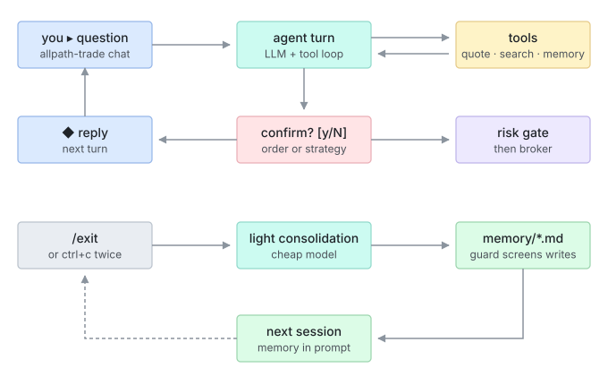
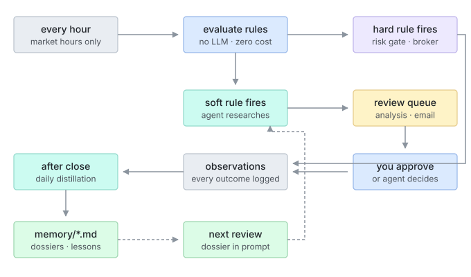

<div align="center">

# All Path Trading Agent

**自部署、基于 LLM 的中长线交易 agent 框架**

*它了解你的目标，与你共创策略，监控市场，通过你自己的券商账户执行交易——并与你共同成长。*

[](LICENSE)
[](https://www.python.org/downloads/)
[](https://github.com/astral-sh/ruff)
[](#路线图)
[](#参与贡献)

[快速上手](#快速上手) ·
[架构](#架构) ·
[安全模型](#安全模型) ·
[路线图](#路线图) ·
[参与贡献](#参与贡献) ·
[English](README.md)

</div>

---

> **项目状态：** Phase 1-5 已完成——券商连接、行情数据、风控和交易日志已可对接 Alpaca 模拟盘账户；策略引擎 + 哨兵循环（YAML 策略、规则求值、版本管理、定时监控、硬规则自动执行）现已运行；LLM agent 核心（多 provider 聊天客户端、工具调用循环、`allpath-trade chat` REPL，以及对已入队软规则触发进行联网研究的 ReviewAgent）已就位；记忆系统（四层精选 markdown 层 + 沉淀 + 会话检索）使 agent 能在跨会话中学习和回忆耐久模式；Web 界面（`allpath-trade serve`，带 token 认证，局域网可达）把仪表盘、聊天和确认队列都带到了你的手机上。下一步是反思循环，详见[路线图](#路线图)。**默认仅模拟盘（paper trading）。**

## 目录

- [概述](#概述)
- [核心特性](#核心特性)
- [架构](#架构)
- [工作原理](#工作原理)
- [安全模型](#安全模型)
- [快速上手](#快速上手)
- [Web 界面](#web-界面)
- [项目结构](#项目结构)
- [路线图](#路线图)
- [开发](#开发)
- [参与贡献](#参与贡献)
- [安全](#安全)
- [免责声明](#免责声明)
- [协议](#协议)

## 概述

大多数 LLM 交易项目止步于*"给出分析"*；大多数量化框架能执行代码却不会推理。**All Path Trading Agent** 为**中长线投资**（持有周期以周和月计，非高频交易）将两者打通：

| 能力 | 说明 |
|---|---|
| **对话式了解** | Agent 通过访谈了解你的风险偏好、资金状况、投资目标与习惯 |
| **策略共创** | 每份策略是一份人机双读的文档：投资论点（prose）+ 确定性的建仓 / 止盈 / 止损规则（机器可校验） |
| **自主监控** | 定时盯盘；触发时 agent 自行搜索最新新闻与价格进行研究，然后再行动 |
| **分级执行** | 通过*你自己的*券商账户交易，授权级别由你选择：仅通知 → 确认后执行 → 额度内自动执行 |
| **持续学习** | 交易后复盘、随时间累积的个股档案、以及影响未来决策的经验教训 |

框架以 Python 包 **`allpath-trade`** 的形式发布，完全运行在你自己的机器上：你的密钥、你的数据、你的决策。

## 核心特性

- **三个运行循环**
  1. **对话循环**——随时可用：讨论股票、制定或修订策略。变更永远遵循 *agent 起草 → 你确认 → 生效*。
  2. **哨兵循环**——盘中每 1 小时（间隔可配置）：确定性代码将价格与策略规则逐条比对，零 LLM 成本。触发后，*硬规则*（如止损）立即执行、全程无 LLM；*软规则*（如逢低加仓）先唤醒 agent 研究当下状况。
  3. **反思循环**——每日收盘后及每笔交易后：agent 用最新信息重新检验各策略论点、审视组合风险并向你报告。

- **四层记忆**

  | 层 | 内容 |
  |---|---|
  | 用户画像 | 风险偏好、目标、决策习惯（缓慢演化） |
  | 策略记忆 | 每个策略的完整版本历史与修订理由 |
  | 个股档案 | 随时间累积的单票知识：行为特征、交易史、个股专属教训 |
  | 经验教训 | 复盘沉淀的洞见，新决策时按相关性检索 |

- **自带 LLM**——Anthropic Claude、OpenAI 或 OpenRouter（一个 key 可用多家模型）；策略工作用强模型，例行检查用便宜模型，规则求值完全不用 LLM。

- **自带券商**——薄且可审计的适配层（官方 `alpaca-py` SDK 之上几百行代码），一次即可读完。更多券商通过 `Broker` 接口接入。

## 架构

```
┌─────────────────────────────────────────────────────┐
│                Web UI（聊天 + 仪表盘）                │   ✅ Phase 5
└──────────────────────────┬──────────────────────────┘
                           │ HTTP / WebSocket
┌──────────────────────────▼──────────────────────────┐
│                  FastAPI 应用层                      │
│  ┌────────────┐  ┌──────────────┐  ┌─────────────┐  │
│  │ Agent 核心 │  │ 策略引擎      │  │ 调度器       │  │   Phases 2–4
│  │ (LLM/工具/ │  │ (规则求值器)  │  │ (哨兵/反思)  │  │
│  │  记忆)     │  │              │  │             │  │
│  └──────┬─────┘  └──────┬───────┘  └──────┬──────┘  │
│  ┌──────▼───────────────▼────────────────▼───────┐  │
│  │     风控守门——确定性代码，不可绕过              │  │   ✅ Phase 1
│  └──────┬─────────────────────────────────────────┘ │
│  ┌──────▼──────┐  ┌────────────┐  ┌──────────────┐  │
│  │ 券商层       │  │ 数据层     │  │ 通知层        │  │   ✅ Phase 1
│  │ (Alpaca)    │  │ (yfinance) │  │ (邮件)       │  │
│  └─────────────┘  └────────────┘  └──────────────┘  │
│        SQLite（策略 · 记忆 · 交易日志）              │
└─────────────────────────────────────────────────────┘
```

设计文档位于 [`docs/superpowers/specs/`](docs/superpowers/specs/)，实现计划位于 [`docs/superpowers/plans/`](docs/superpowers/plans/)。

## 工作原理

**对话循环**——你提问，agent 用实时工具研究；凡是碰钱或改策略文件的动作都会停下来向你确认。退出时它把这次对话炼进精选记忆，为下一次会话打底（虚线）。



**哨兵循环**——你不在时它自己跑。确定性规则检查零成本；硬规则（止损）执行全程无 LLM，软规则则唤醒 agent 先研究再入队等你批准。每个结果都记入日志，收盘后被炼进同一份记忆，让下一次复核更准。



## 安全模型

整个框架建立在一条不变量之上：**LLM 永远无法绕过你的限制。**

```
LLM / 策略规则  →  订单意图  →  风控守门（确定性）  →  券商（官方 SDK）
                                    │
                             交易日志（SQLite 审计）
```

| 保证 | 机制 |
|---|---|
| 通往券商的唯一路径 | `Executor.execute()` 是唯一能提交订单的代码路径；LLM 只能产出 `OrderIntent` |
| 确定性事前检查 | 单笔金额上限、单股仓位上限、当日交易次数上限、现金储备均由普通代码硬性执行——环节中没有模型 |
| 模拟盘优先 | 真实交易默认关闭，需显式开启（`allow_live`），开启后仍受风控守门约束 |
| 止损保底 | 硬规则不经过 LLM 执行——不会因模型或 API 故障而失灵 |
| 完整可审计 | 每笔交易、拒单和错误连同完整决策理由记录在本地 |
| 本地密钥 | LLM 与券商密钥存于本地 `.env`（已 gitignore），不向任何地方传输 |

## 快速上手

### 前置条件

- Python ≥ 3.11 与 [uv](https://docs.astral.sh/uv/)
- 一个免费的 [Alpaca 模拟盘账户](https://app.alpaca.markets/paper/dashboard/overview)
- 编译时启用 FTS5 的 SQLite（Python ≥ 3.11 官方构建默认包含）——记忆搜索功能需要

### 安装

```bash
git clone https://github.com/dukesky/allpath-trading-agent.git
cd allpath-trading-agent
uv sync
```

### 配置

```bash
cp .env.example .env
# 编辑 .env，填入 ALPACA_API_KEY / ALPACA_SECRET_KEY
```

所有密钥只存在这个本地文件里。`ALPACA_PAPER=true` 为默认值；真实交易还需在风控限制中开启 `allow_live`。

### 验证

```bash
uv run allpath-trade status
uv run allpath-trade chat   # 与 agent 对话（需要在 .env 中配置 LLM 与 Alpaca 密钥）
```

预期输出：模拟盘账户净值、现金、购买力、持仓与最近的交易日志。

### 运行 Web 界面

```bash
uv run allpath-trade serve
```

打开 `http://localhost:8791`。访问 token 在启动时打印，并保存为 `.env` 中的
`WEB_TOKEN`。要从手机在同一网络下访问，绑定到所有网卡：

```bash
uv run allpath-trade serve --host 0.0.0.0
```

哨兵在同一进程内运行，所以这一条命令同时覆盖了监控、记忆沉淀和 Web 界面。

## Web 界面

`allpath-trade serve` 在同一进程里运行 FastAPI 应用与哨兵调度器（默认端口
8791）。Token 在首次启动时生成一次并写入 `.env`；之后启动会复用它，不再重复
打印；如果泄露，可以在设置页重置。用该 token 在打印出的地址登录——会话
cookie 带 `HttpOnly` 和 `SameSite=Strict`。没有内置 HTTPS，所以只在你信任的
网络上使用 `--host 0.0.0.0`。

| 页面 | 用途 |
|---|---|
| Dashboard | 账户净值、持仓、生效中的策略、最近交易 |
| Chat | 与 `allpath-trade chat` 相同的 agent，agent 提出的订单会以内联卡片等待确认 |
| Pending | 确认队列——批准或拒绝 agent 提出的订单，每笔都带风控预检 |
| Strategies | 策略文档与版本历史，只读；保存修改目前仍需在终端里用 `allpath-trade chat`（见[路线图](#路线图)） |
| Memory | 四层记忆及其变更历史，只读 |
| Settings | LLM / 券商密钥（只写，从不回显）、邮件通知设置、哨兵检查间隔、记忆沉淀开关 |

Agent 在 Chat 里提出的订单不会直接送到券商——它们会进入 Pending 队列，与
哨兵软规则触发的流程完全一样，只有你批准后才会真正下单。切换到真实交易在
Web 界面里不可达，仍需直接编辑 `.env`（见[安全模型](#安全模型)）。

## 项目结构

```
allpath_trade/          # import 包名（PyPI / CLI 名为 allpath-trade）
├── broker/       # 券商抽象 + Alpaca 适配器
├── data/         # 行情数据源（yfinance）
├── risk/         # 确定性风控守门
├── store/        # SQLite 持久化 + 交易日志
├── execution.py  # 订单执行器——唯一交易入口
├── config.py     # 配置 + 可运行时读写的 .env 存储
└── cli.py        # 命令行界面
```

## 路线图

| Phase | 范围 | 状态 |
|:---:|---|:---:|
| 1 | **执行地基**——券商抽象、Alpaca（模拟盘）适配器、行情数据、风控守门、交易日志、执行器、CLI | ✅ 已完成 |
| 2 | **策略引擎 + 哨兵循环**——YAML 策略文档、受限表达式规则求值器、版本管理、定时监控、硬规则自动执行 | ✅ 已完成 |
| 3 | **Agent 核心**——多 provider LLM 层（Claude / OpenAI / OpenRouter）、工具循环、上下文组装、`allpath-trade chat` REPL、为哨兵触发附加分析的 ReviewAgent | ✅ 已完成 |
| 4 | **记忆系统**——四层记忆 + 每个循环后的交叉沉淀 | ✅ 已完成 |
| 5 | **Web UI + 通知**——`allpath-trade serve`、token 认证、聊天、仪表盘、待确认队列、设置页、邮件 | ✅ 已完成 |
| 6 | **反思循环**——每日深度 review、交易后复盘 | 🔜 下一步 |

## 开发

```bash
uv run pytest                  # 单元测试（不联网）
uv run pytest -m integration   # 集成测试——需要 Alpaca 模拟盘密钥
uv run ruff check .            # lint
uv run allpath-trade chat          # 与 agent 对话（需要在 .env 中配置 LLM 与 Alpaca 密钥）
uv run allpath-trade memory show   # 查看 agent 记忆文件
```

**工程约定**

- Python ≥ 3.11；核心为同步代码（中长线交易不需要 async）
- 金额一律使用 `Decimal`，绝不使用 `float`
- 资金路径模块（风控守门、执行器、日志）要求完备的单元测试
- 单元测试不触网；券商 / 数据客户端均可注入

## 参与贡献

欢迎贡献。高价值方向：

- **券商适配器**——Interactive Brokers（经 `ib_async`）、Tradier、Charles Schwab
- **数据源**——Tiingo（日线）、Finnhub（新闻 / 情绪）
- **健壮性加固**——资金路径上的边界情况、错误处理与测试覆盖

较大的改动请先开 issue 讨论再提 pull request。所有资金路径代码都要求附带完备测试。

## 安全

- 切勿提交 `.env` 或任何密钥；仓库的 `.gitignore` 默认已排除。
- 适配层将所有认证与传输委托给券商官方 SDK。
- 如需报告安全漏洞，请开一个只含最小细节与联系方式的 GitHub issue，我们将私下跟进。

## 免责声明

本项目是以 MIT 协议发布的自部署软件，**不构成投资建议**。交易存在重大亏损风险。你需对自己的交易决策、密钥保管及券商服务条款的合规性承担全部责任。请从模拟盘开始；仅在完全理解并接受风险后再开启真实交易。

## 协议

本项目以 [MIT License](LICENSE) 发布。
