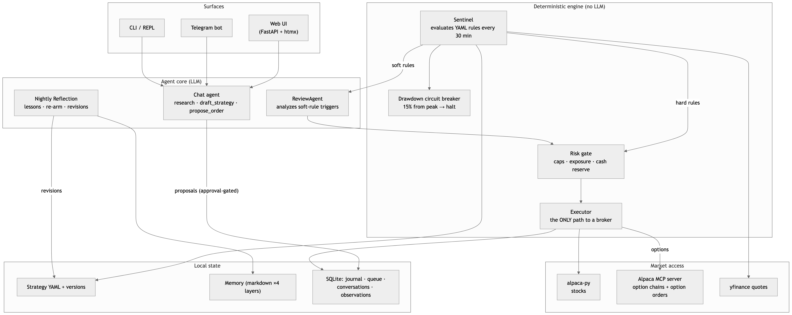
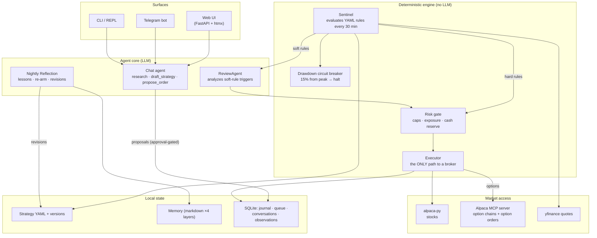

# AllPath Trading Agent — One-Pager

**Options Alpha Agents · Alpaca AI Trading Agents Hackathon**
A self-hosted agent that **plans with LLMs, trades with deterministic code, and improves itself every night.**
[github.com/dukesky/allpath-trading-agent](https://github.com/dukesky/allpath-trading-agent) · MIT · 2,368 tests

## System architecture

```
 ① THINK — multi-tier LLM agent      ② DECIDE — strategies as code       ③ TRADE — Alpaca infrastructure
 ┌────────────────────────────┐      ┌────────────────────────────┐      ┌────────────────────────────┐
 │ You ↔ Agent                │      │ Strategy YAML              │      │ Stocks · alpaca-py         │
 │  web chat · Telegram · CLI │      │  prose thesis +            │      │  paper TradingClient,      │
 │  approve with one tap, or  │      │  deterministic rules:      │      │  timeout-hardened          │
 │  grant per-strategy        │      │  buy_call $1500 dte>=5     │      ├────────────────────────────┤
 │  autonomy (notify /        │      │  otm=3% · close_options    │      │ Options · official Alpaca  │
 │  confirm / auto)           │      ├──────────────┬─────────────┤      │ MCP server (managed uvx    │
 ├────────────────────────────┤      │ Sentinel     ▼ every 30min │      │ subprocess, auto-respawn)  │
 │ 3 model tiers              │      │  zero LLM cost; this week  │      │  chain(expiry≥dte)         │
 │  sonnet-5 chat · haiku     │      │  the intraday path made    │      │  → strike ≈ spot×(1±otm)   │
 │  review · opus-5 memory    │      │  NO LLM calls at all       │      │  → qty=⌊budget/(ask×100)⌋  │
 ├────────────────────────────┤      ├──────────────┬─────────────┤      │  → place_option_order      │
 │ Layered memory short→long  │      │ Risk Gate    ▼ plain code  │      ├────────────────────────────┤
 │  observations (days) →     │      │  ≤$5k/order · ≤25%/pos ·   │      │ Safety net, always on      │
 │  dossiers (weeks) →        │      │  options ≤10% equity ·     │      │  15% drawdown breaker ·    │
 │  profile & lessons         │      │  risk-cuts never blocked   │      │  DTE≤1 expiry sweep ·      │
 ├────────────────────────────┤      ├──────────────┬─────────────┤      │  market-hours discipline · │
 │ Nightly reflection         │      │ Executor     ▼             │      │  honest failure (no id ⇒   │
 │  review → lessons → re-arm │      │  the ONLY path to a broker │      │  error + page, never a     │
 │  → revise own strategies   │      │  everything → SQLite       │      │  phantom fill)             │
 └────────────────────────────┘      └────────────────────────────┘      └────────────────────────────┘
```

## What makes it different

- **LLM thinks nightly; code trades intraday.** Inference goes to research and reflection — execution is deterministic, auditable, outage-proof.
- **It genuinely improves itself.** Night 1 it found a stop→re-entry flaw in all 5 of its own strategies, unprompted; mid-week it wrote salvage rules that recovered **~$1,165** of decaying option premium; its final report critiques its own stop placement.
- **Autonomy is earned, bounded, revocable.** Per-strategy tiers (notify/confirm/auto); revisions pass byte-exact staleness + strict version checks; a freeze bars the agent from ever raising its own authorization.
- **Everything is explainable.** Strategies are readable YAML; every decision has a journal row; every nightly report ships a full tool-call transcript.

## The live run — honest scoreboard

- Fresh **$100k** paper account · one kickoff chat · then **5 days hands-off** (0 human trading decisions)
- **17 rule-driven fills** — 4 stock legs + 5 option legs in; every exit by stop, salvage, or expiry sweep
- **12 nightly self-revisions** auto-applied through the guarded pipeline
- **−4.9%** ($95,138): stock book ≈ flat (−$180); the 5-DTE options overlay paid −$4.7k tuition — **diagnosed in writing by the agent itself on night one**, then corrected all week

> Judges' shortcut: the **Reports page** replays every nightly reflection with its full tool-call transcript — the audit trail *is* the demo.

## Full framework — how the pieces connect



<details><summary>Same diagram as mermaid source</summary>



</details>
